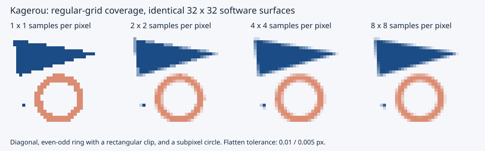

# Coverage quality and cost

Run `pixi run --locked bench-coverage`. The benchmark compiles with Mojo 1.0.0
at `-O3`. A 64 x 64 surface contains a radius-24.23 circle centered at
(31.17, 31.39), deliberately away from integral coordinates. Each measurement
uses three warmups followed by 15 batches of 40 calls; it reports nearest-rank
p50/p95 microseconds per fill. Surface/path allocation is outside timing;
flattening, edge/crossing allocation, row counts, rasterization, and compositing
are included. Observed pixels prevent dead-store elimination.

Coverage error is mean absolute error across all 4,096 pixels against an
independent analytic circle sampled on a 256 x 256 grid per pixel. The reference
is computed before timing without the rasterizer, flattening, or cubic curves.
It includes both cubic-circle approximation and flattening error, as well as
sampling and RGBA8 quantization. It is an approximation to geometric area, not
an exact integral. This fixture is reproducible and uses no external data.

Measured 2026-09-05 on Apple M4, ARM64, Darwin 25.5.0, Mojo 1.0.0, `-O3`:

| Samples/axis | Flatten tolerance | p50 µs | p95 µs | Mean absolute coverage error |
| ---: | ---: | ---: | ---: | ---: |
| 1 (binary) | 0.25 | 7.825 | 8.500 | 0.009224 |
| 2 | 0.25 | 30.925 | 38.950 | 0.003937 |
| 4 | 0.25 | 43.925 | 58.500 | 0.002879 |
| 8 | 0.25 | 83.975 | 91.250 | 0.002752 |
| 16 | 0.25 | 133.725 | 164.350 | 0.002770 |
| 1 (binary) | 0.01 | 36.775 | 43.025 | 0.009022 |
| 2 | 0.01 | 72.950 | 86.850 | 0.003151 |
| 4 | 0.01 | 106.600 | 202.975 | 0.001147 |
| 8 | 0.01 | 174.475 | 277.875 | 0.000345 |
| 16 | 0.01 | 303.725 | 419.100 | 0.000149 |

[Raw CSV](results/coverage-2026-09-05.csv) also records fractional-pixel counts
and output checksums. Concurrent development workloads were active on this
machine; especially the p95 values are observations, not isolated throughput
guarantees. Rerun on the deployment target.

The unchanged binary path is the cost baseline. Four samples per axis improves
this fixture at moderate extra cost; eight or sixteen samples improve quality
further only with a sufficiently fine flattening tolerance. At tolerance 0.25,
geometric error dominates and 16 samples do not beat 8. A regular grid does not
promise monotonic error for every shape/translation, even at fixed tolerance.

Regenerate the visual comparison with:

```sh
pixi run --locked example-coverage > docs/images/coverage-gallery.svg
```

The SVG contains actual software RGBA8 pixels as 6 x 6 rectangles, so browser
vector antialiasing cannot disguise the rasterizer's sampling differences.
It shows a subpixel diagonal, an even-odd ring crossing an integer clip edge,
and a radius-0.65 circle at quality 1, 2, 4, and 8. It uses tolerance 0.01 for
the larger curves and 0.005 for the tiny circle.


